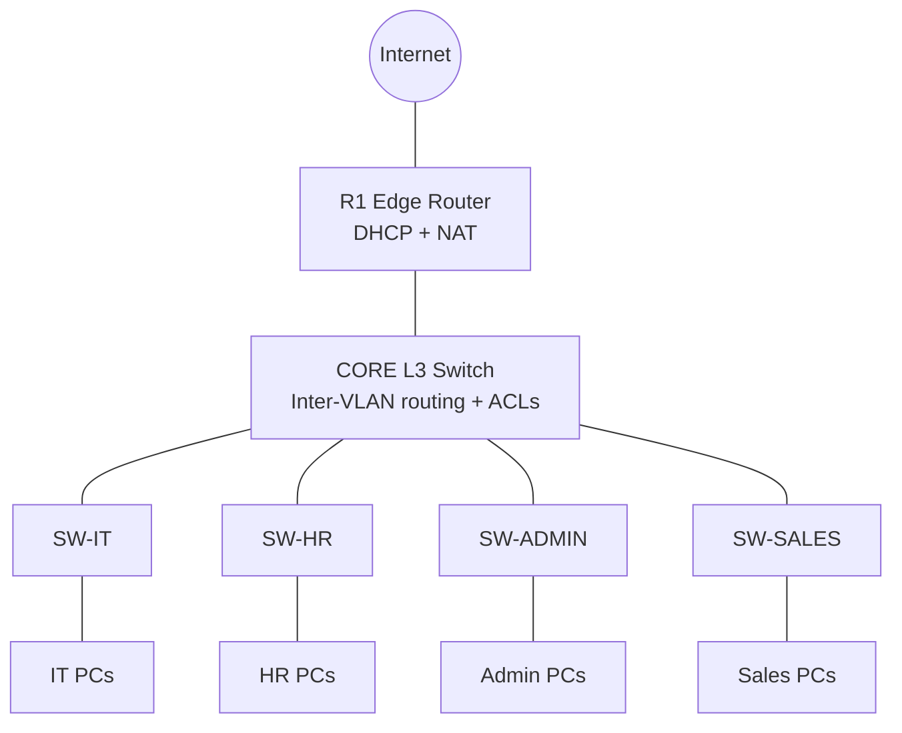

# Office Network Automation (Python + AI)

A four-department office network (IT, HR, Admin, Sales) built with VLANs, inter-VLAN routing, DHCP, NAT and ACLs, plus Python tooling that generates, deploys, verifies and backs up the configuration, and uses Claude to review configs and troubleshoot problems.


## Features

- **Config as code**: one `inventory.yaml` drives every device config through Jinja2 templates
- **Safe deployment**: Netmiko pushes configs over SSH, as a dry run unless you pass `--apply`
- **Verification**: checks VLANs, SVIs, ACLs and the default route against the inventory
- **Backups**: timestamped running-configs with secrets masked
- **AI assistant**: Claude reviews configs for security gaps, diagnoses issues from live `show` output, and explains config changes between backups
- **Lab guide**: a step-by-step Packet Tracer walkthrough so the design can be built and tested without hardware

## Network design



### Addressing

| Department | VLAN | Subnet | Gateway |
|---|---|---|---|
| IT | 10 | 192.168.10.0/24 | 192.168.10.1 |
| HR | 20 | 192.168.20.0/24 | 192.168.20.1 |
| Admin | 30 | 192.168.30.0/24 | 192.168.30.1 |
| Sales | 40 | 192.168.40.0/24 | 192.168.40.1 |
| Management | 99 | 192.168.99.0/24 | 192.168.99.1 |

CORE to R1 uses 10.0.0.0/30. Switch management IPs are 192.168.99.11 to .14.

### Access policy

| From / To | IT | HR | Admin | Sales | Internet |
|---|---|---|---|---|---|
| IT | ✔ | ✔ | ✔ | ✔ | ✔ |
| HR | ✔ | ✔ | ✘ | ✘ | ✔ |
| Admin | ✘ | ✘ | ✔ | ✔ | ✔ |
| Sales | ✘ | ✘ | ✔ | ✔ | ✔ |

HR is isolated from Admin and Sales because it handles sensitive data. IT can reach everything for support. Admin and Sales cannot start connections to IT or HR. The ACLs are stateless, so return traffic to IT is permitted explicitly (`echo-reply` and `established`).

## Repository structure

```
.
├── inventory.yaml            # single source of truth: VLANs, devices, deny rules
├── templates/
│   ├── core.j2               # core switch template (VLANs, SVIs, trunks, ACLs)
│   └── access.j2             # access switch template
├── automation/
│   ├── common.py             # inventory loading, SSH connection, secret masking
│   ├── generate_configs.py   # render configs from templates
│   ├── deploy.py             # push configs (dry run by default)
│   ├── verify.py             # compare live state to the inventory
│   ├── backup.py             # save masked running-configs
│   └── ai_assistant.py       # Claude-powered review, troubleshooting, diffs
├── configs/                  # generated device configs
├── backups/                  # timestamped backups (git-ignored)
├── docs/
│   └── PACKET_TRACER_LAB.md  # step-by-step lab guide
├── lab-files/                # put your .pkt file here
├── screenshots/              # topology and verification screenshots
├── requirements.txt
└── .env.example
```

## Getting started

**Requirements:** Python 3.10 or newer, SSH reachability to the devices, and an Anthropic API key for the AI features.

```bash
git clone https://github.com/<your-username>/office-network-automation.git
cd office-network-automation
python -m venv venv
source venv/bin/activate          # Windows: venv\Scripts\activate
pip install -r requirements.txt
cp .env.example .env              # then fill in credentials and API key
```

Devices need SSH enabled:

```
ip domain-name lab.local
crypto key generate rsa modulus 2048
username admin privilege 15 secret <password>
line vty 0 4
 transport input ssh
 login local
```

## Usage

```bash
# 1. Generate configs from inventory.yaml
python automation/generate_configs.py

# 2. Have Claude audit them before deployment
python automation/ai_assistant.py review

# 3. Dry run, then push for real
python automation/deploy.py
python automation/deploy.py --apply
python automation/deploy.py --apply --only CORE

# 4. Verify the live network matches the inventory
python automation/verify.py

# 5. Back up configs (run twice to enable diffs)
python automation/backup.py
python automation/ai_assistant.py diff CORE

# 6. Troubleshoot in plain English
python automation/ai_assistant.py troubleshoot "Sales cannot reach the internet"
```

### Common changes

| Goal | What to edit |
|---|---|
| Add a department | Add a VLAN entry and a switch in `inventory.yaml`, then regenerate |
| Change who can reach whom | Edit the `deny` section in `inventory.yaml` |
| Change the uplink | Edit the `uplink` section in `inventory.yaml` |

## Build it in Packet Tracer

No hardware needed. Follow [docs/PACKET_TRACER_LAB.md](docs/PACKET_TRACER_LAB.md) for devices, cabling, configs, a ping test matrix and troubleshooting. Add your finished lab as `lab-files/office-network.pkt`.

## Security notes

- Credentials and the API key live in `.env`, which is git-ignored. Never commit it.
- Backups and AI prompts are masked for passwords, SNMP communities and keys. Review the masking rules in `automation/common.py` before using real production configs.
- AI output is advice, not an authority. Read suggested commands before applying them.
- Test in a lab before touching production devices.

## Known limitations

- The ACLs are stateless. For real stateful filtering, put a firewall between departments.
- The core uses a single switch, so there is no redundancy.
- `verify.py` checks device state, not end-to-end traffic.
- The deployment and AI scripts have not been tested against live devices or the API, so run them in a lab first.
- The core template includes `switchport trunk encapsulation dot1q`, which some switch models (such as the Packet Tracer 3650) reject. Remove the line if yours does.

## Roadmap

- [ ] Server VLAN and guest Wi-Fi VLAN
- [ ] Redundant core with HSRP and EtherChannel
- [ ] Scheduled backups with automatic Git commits
- [ ] Web dashboard for status and AI chat
- [ ] Syslog and SNMP monitoring

## License

MIT. See [LICENSE](LICENSE).

## Author

Your Name · [GitHub](https://github.com/<your-username>) · [LinkedIn](https://linkedin.com/in/<your-profile>)
