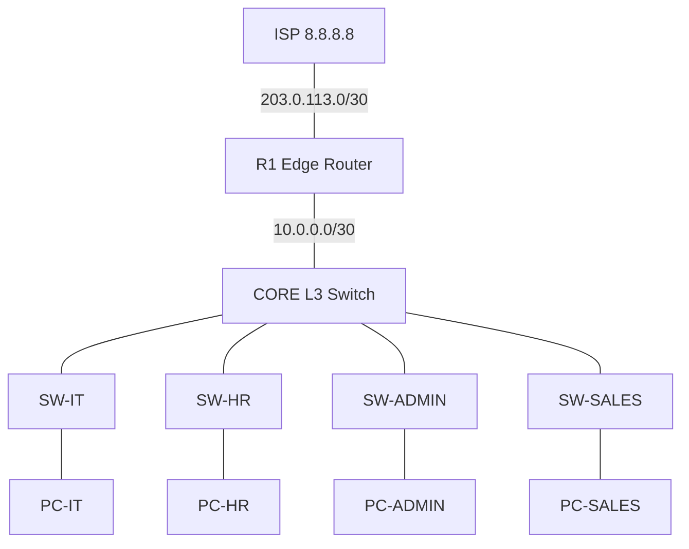

# Packet Tracer Lab: Office Network with IT, HR, Admin and Sales VLANs

## 1. Objectives
- Segment an office into four department VLANs plus a management VLAN
- Configure inter-VLAN routing on a Layer 3 core switch
- Serve DHCP for all VLANs from the edge router using relay (`ip helper-address`)
- Provide internet access with NAT overload
- Restrict traffic between departments with extended ACLs and verify the policy

Estimated time: 60 to 90 minutes. Tested with Cisco Packet Tracer 8.x.

## 2. Devices

| Qty | Device | Packet Tracer model | Name |
|---|---|---|---|
| 1 | ISP router | 2911 | ISP |
| 1 | Edge router | 2911 | R1 |
| 1 | Core L3 switch | 3650-24PS | CORE |
| 4 | Access switches | 2960-24TT | SW-IT, SW-HR, SW-ADMIN, SW-SALES |
| 4 | PCs (one per department) | PC | PC-IT, PC-HR, PC-ADMIN, PC-SALES |

## 3. Topology



## 4. Addressing plan

| Department | VLAN | Subnet | Gateway | DHCP range |
|---|---|---|---|---|
| IT | 10 | 192.168.10.0/24 | 192.168.10.1 | .50 and up |
| HR | 20 | 192.168.20.0/24 | 192.168.20.1 | .50 and up |
| Admin | 30 | 192.168.30.0/24 | 192.168.30.1 | .50 and up |
| Sales | 40 | 192.168.40.0/24 | 192.168.40.1 | .50 and up |
| Management | 99 | 192.168.99.0/24 | 192.168.99.1 | static |
| CORE to R1 | n/a | 10.0.0.0/30 | CORE .1, R1 .2 | static |
| R1 to ISP | n/a | 203.0.113.0/30 | ISP .1, R1 .2 | static |

Management IPs: SW-IT .11, SW-HR .12, SW-ADMIN .13, SW-SALES .14.

## 5. Cabling

| From | Port | To | Port | Cable |
|---|---|---|---|---|
| ISP | Gi0/0 | R1 | Gi0/1 | Copper cross-over |
| R1 | Gi0/0 | CORE | Gi1/0/1 | Copper straight-through |
| CORE | Gi1/0/2 | SW-IT | Gi0/1 | Copper cross-over |
| CORE | Gi1/0/3 | SW-HR | Gi0/1 | Copper cross-over |
| CORE | Gi1/0/4 | SW-ADMIN | Gi0/1 | Copper cross-over |
| CORE | Gi1/0/5 | SW-SALES | Gi0/1 | Copper cross-over |
| Each PC | Fa0 | its access switch | Fa0/1 | Copper straight-through |

## 6. Configuration

Open each device's **CLI** tab, press Enter, and type `enable` then `configure terminal` before pasting.

### Step 1: ISP (simulates the internet)

```
hostname ISP
interface g0/0
 ip address 203.0.113.1 255.255.255.252
 no shutdown
interface loopback0
 ip address 8.8.8.8 255.255.255.255
```

### Step 2: R1 (DHCP, NAT, routing)

```
hostname R1

ip dhcp excluded-address 192.168.10.1 192.168.10.49
ip dhcp excluded-address 192.168.20.1 192.168.20.49
ip dhcp excluded-address 192.168.30.1 192.168.30.49
ip dhcp excluded-address 192.168.40.1 192.168.40.49

ip dhcp pool IT
 network 192.168.10.0 255.255.255.0
 default-router 192.168.10.1
 dns-server 8.8.8.8
ip dhcp pool HR
 network 192.168.20.0 255.255.255.0
 default-router 192.168.20.1
 dns-server 8.8.8.8
ip dhcp pool ADMIN
 network 192.168.30.0 255.255.255.0
 default-router 192.168.30.1
 dns-server 8.8.8.8
ip dhcp pool SALES
 network 192.168.40.0 255.255.255.0
 default-router 192.168.40.1
 dns-server 8.8.8.8

interface g0/0
 ip address 10.0.0.2 255.255.255.252
 ip nat inside
 no shutdown
interface g0/1
 ip address 203.0.113.2 255.255.255.252
 ip nat outside
 no shutdown

access-list 1 permit 192.168.0.0 0.0.255.255
ip nat inside source list 1 interface g0/1 overload

ip route 0.0.0.0 0.0.0.0 203.0.113.1
ip route 192.168.0.0 255.255.0.0 10.0.0.1
```

### Step 3: CORE (VLANs, SVIs, trunks, ACLs)

This is generated by `automation/generate_configs.py` from `inventory.yaml`. Paste it exactly as shown:

```
hostname CORE
ip routing
vlan 10
 name IT
vlan 20
 name HR
vlan 30
 name ADMIN
vlan 40
 name SALES
vlan 99
 name MGMT
interface vlan 10
 ip address 192.168.10.1 255.255.255.0
 ip helper-address 10.0.0.2
interface vlan 20
 ip address 192.168.20.1 255.255.255.0
 ip helper-address 10.0.0.2
 ip access-group HR-IN in
interface vlan 30
 ip address 192.168.30.1 255.255.255.0
 ip helper-address 10.0.0.2
 ip access-group ADMIN-IN in
interface vlan 40
 ip address 192.168.40.1 255.255.255.0
 ip helper-address 10.0.0.2
 ip access-group SALES-IN in
interface vlan 99
 ip address 192.168.99.1 255.255.255.0
interface g1/0/1
 no switchport
 ip address 10.0.0.1 255.255.255.252
interface range g1/0/2 - 5
 switchport trunk encapsulation dot1q
 switchport mode trunk
 switchport trunk allowed vlan 10,20,30,40,99
ip route 0.0.0.0 0.0.0.0 10.0.0.2
ip access-list extended HR-IN
 permit udp any eq bootpc any eq bootps
 permit ip 192.168.20.0 0.0.0.255 192.168.20.0 0.0.0.255
 deny ip 192.168.20.0 0.0.0.255 192.168.30.0 0.0.0.255
 deny ip 192.168.20.0 0.0.0.255 192.168.40.0 0.0.0.255
 permit ip 192.168.20.0 0.0.0.255 any
ip access-list extended SALES-IN
 permit udp any eq bootpc any eq bootps
 permit ip 192.168.40.0 0.0.0.255 192.168.40.0 0.0.0.255
 deny ip 192.168.40.0 0.0.0.255 192.168.20.0 0.0.0.255
 permit icmp 192.168.40.0 0.0.0.255 192.168.10.0 0.0.0.255 echo-reply
 permit tcp 192.168.40.0 0.0.0.255 192.168.10.0 0.0.0.255 established
 deny ip 192.168.40.0 0.0.0.255 192.168.10.0 0.0.0.255
 permit ip 192.168.40.0 0.0.0.255 any
ip access-list extended ADMIN-IN
 permit udp any eq bootpc any eq bootps
 permit ip 192.168.30.0 0.0.0.255 192.168.30.0 0.0.0.255
 deny ip 192.168.30.0 0.0.0.255 192.168.20.0 0.0.0.255
 permit icmp 192.168.30.0 0.0.0.255 192.168.10.0 0.0.0.255 echo-reply
 permit tcp 192.168.30.0 0.0.0.255 192.168.10.0 0.0.0.255 established
 deny ip 192.168.30.0 0.0.0.255 192.168.10.0 0.0.0.255
 permit ip 192.168.30.0 0.0.0.255 any

```

Notes:
- If CORE rejects `switchport trunk encapsulation dot1q`, delete that line. The 3650 only supports 802.1Q.
- The first line of each ACL permits DHCP. Without it, clients cannot get an address because their discover packets (source 0.0.0.0) would hit the implicit deny.
- ACLs are stateless, so the IT return-path lines (`echo-reply` and `established`) let replies reach IT while still blocking Sales and Admin from starting connections to IT.
- Finish with `end`, then `write memory`.

### Step 4: Access switches

Example for SW-IT (configs for the others are in `configs/`):

```
hostname SW-IT
vlan 10
 name IT
vlan 99
 name MGMT
interface g0/1
 switchport mode trunk
 switchport trunk allowed vlan 10,99
interface range f0/1 - 24
 switchport mode access
 switchport access vlan 10
 spanning-tree portfast
 spanning-tree bpduguard enable
 switchport port-security
 switchport port-security maximum 2
 switchport port-security violation restrict
interface vlan 99
 ip address 192.168.99.11 255.255.255.0
ip default-gateway 192.168.99.1
```

| Switch | VLAN | Interface VLAN 99 IP |
|---|---|---|
| SW-IT | 10 | 192.168.99.11 |
| SW-HR | 20 | 192.168.99.12 |
| SW-ADMIN | 30 | 192.168.99.13 |
| SW-SALES | 40 | 192.168.99.14 |

### Step 5: PCs

For each PC open **Desktop > IP Configuration** and select **DHCP**.

## 7. Verification

On CORE:

```
show vlan brief
show ip interface brief
show interfaces trunk
show ip route
show access-lists
```

On R1:

```
show ip dhcp binding
show ip nat translations
```

Each PC should receive an address ending in `.50` from its own subnet.

## 8. Test matrix

From each PC, open **Desktop > Command Prompt** and run the pings.

| From | To | Expected |
|---|---|---|
| PC-IT | PC-HR, PC-ADMIN, PC-SALES | Success |
| PC-IT | 8.8.8.8 | Success |
| PC-HR | PC-ADMIN, PC-SALES | Fail |
| PC-HR | PC-IT, 8.8.8.8 | Success |
| PC-ADMIN | PC-SALES, 8.8.8.8 | Success |
| PC-ADMIN | PC-HR, PC-IT | Fail |
| PC-SALES | PC-ADMIN, 8.8.8.8 | Success |
| PC-SALES | PC-HR, PC-IT | Fail |

The first ping in any test can time out while ARP resolves. Judge the result by the next three replies. After testing, run `show access-lists` on CORE and confirm the deny counters have increased.

## 9. Troubleshooting

| Symptom | Likely cause | Fix |
|---|---|---|
| PC shows 169.254.x.x | DHCP not reaching R1 | Check `ip helper-address`, the DHCP ACL line, the trunk allowed VLANs and R1's return route to 192.168.0.0/16 |
| No internet from any VLAN | NAT or default route | Check `show ip nat translations` and that R1 has `ip route 0.0.0.0 0.0.0.0 203.0.113.1` |
| One department cannot reach anything | Access port in the wrong VLAN | `show vlan brief` on its switch |
| Trunk not forming | VLAN missing on trunk | `show interfaces trunk` and compare allowed VLANs |
| Everything works, even blocked paths | ACL not applied | `show ip interface vlan 20` should show the inbound ACL |

## 10. Save and publish

1. Save as `lab-files/office-network.pkt`.
2. Take screenshots of the topology, `show ip dhcp binding`, a successful IT ping and a blocked HR ping. Put them in `screenshots/`.
3. Commit:
   ```bash
   git add .
   git commit -m "Add Packet Tracer lab guide and lab file"
   git push
   ```
